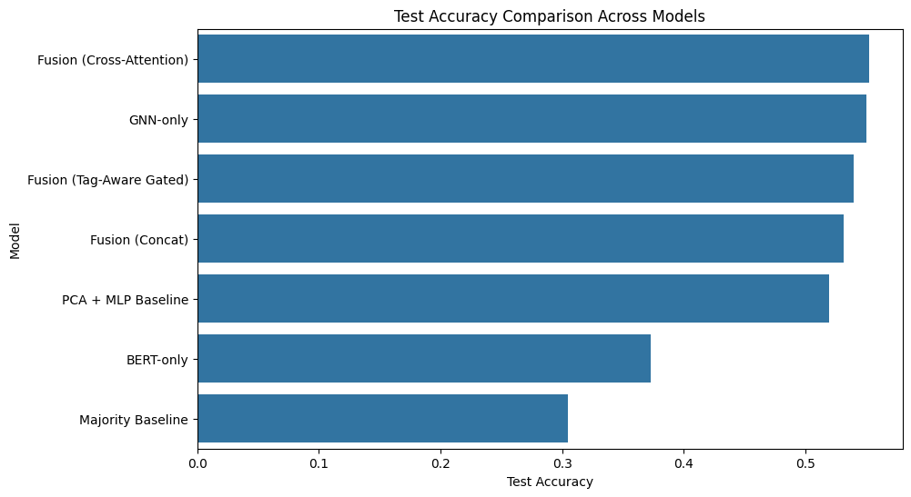
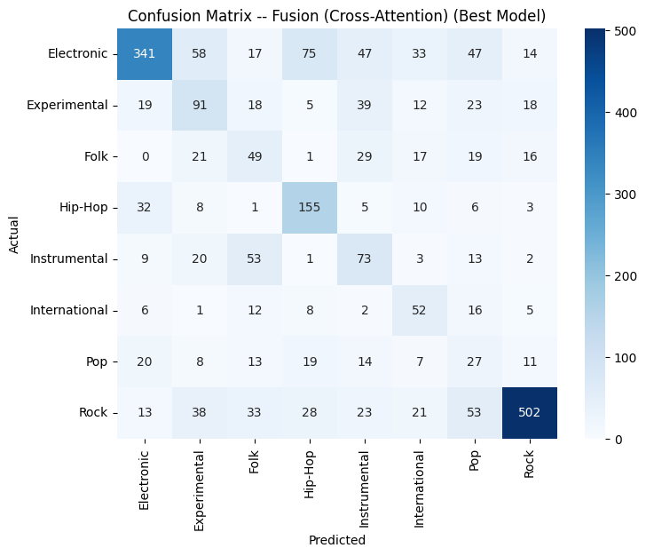
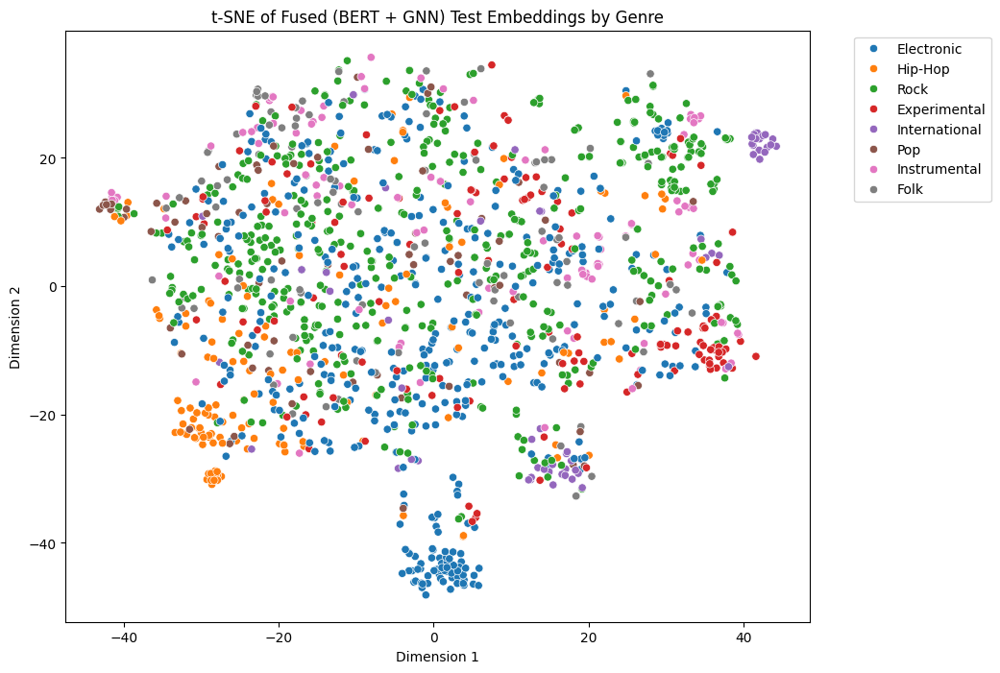
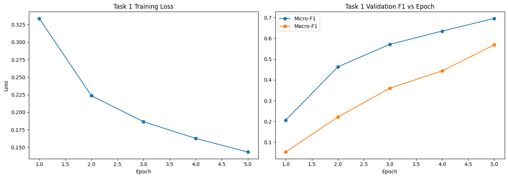

# Understanding Musical Context Using a Hybrid BERT and Graph Neural Network Framework


## Overview

Music understanding is a challenging problem because music contains multiple sources of information, including acoustic patterns, semantic descriptions, genre characteristics, and structural relationships.

This project investigates a multimodal deep learning framework that combines:

- **BERT (Bidirectional Encoder Representations from Transformers)** for semantic understanding of music descriptions
- **Graph Neural Networks (GNNs)** for learning structural relationships within music
- **Multimodal fusion techniques** for combining textual and graph-based representations


The main objective of this project is to investigate whether combining semantic information from text descriptions with structural information from music representations can improve music context understanding.


# Project Tasks

The project consists of three major tasks:


## Task 1: BERT-based MusicCaps Multi-label Classification

This task investigates whether textual descriptions alone can provide meaningful information about musical context.

The MusicCaps captions are processed using a BERT-based model to learn semantic representations and predict multiple musical attributes.

### Results

| Metric | Score |
|---|---|
| Micro-F1 | 0.7001 |
| Macro-F1 | 0.5701 |
| Macro AUC-PR | 0.7075 |


The results demonstrate that human-written music descriptions contain valuable semantic information about instruments, mood, style, and musical characteristics.


---

## Task 2: GNN-based Music Structural Learning

The second task investigates whether graph-based representations can capture musical structure.

Music is represented as a graph:

- Nodes represent musical segments
- Edges represent relationships between segments based on similarity and temporal information


The Graph Neural Network learns structural information by propagating information between connected musical components.

This allows the model to capture:

- Repeated musical patterns
- Segment relationships
- Structural organization
- Acoustic similarity


---

## Task 3: BERT-GNN Multimodal Fusion

The final task combines semantic and structural representations.

The framework combines:

- Text representation from BERT
- Graph representation from GNN


Three fusion strategies are evaluated:

1. Feature concatenation fusion
2. Gated fusion
3. Cross-attention fusion


The goal is to learn complementary information from both modalities.


# Dataset Information


## MusicCaps Dataset

MusicCaps is used for the BERT-based music context understanding task.

The dataset contains:

- Music audio clips
- Human-written captions
- Semantic descriptions of musical content


The dataset is used for:

- Text-based music understanding
- Multi-label classification using BERT


More information:

```
data/dataset_info.md
```


## Free Music Archive (FMA) Dataset

The FMA dataset is used for graph-based music representation learning.

The dataset contains:

- Music tracks
- Genre labels
- Audio features


The dataset is used for:

- GNN-based structural learning
- Music genre classification


The original datasets are not included in this repository because of their large size.


# Experimental Results


## Model Performance Comparison


| Model | Accuracy | Macro-F1 | AUC-PR |
|---|---|---|---|
| Majority Baseline | 30.45% | 5.84% | 12.50% |
| BERT Only | 37.26% | 32.99% | 32.84% |
| PCA + MLP | 51.99% | 38.73% | 38.45% |
| GNN Only | 55.03% | 44.80% | 47.63% |
| Concatenation Fusion | 53.15% | 43.31% | 46.80% |
| Gated Fusion | 54.00% | 44.68% | 47.03% |
| **Cross Attention Fusion** | **55.25%** | **45.31%** | **47.72%** |


The cross-attention fusion model achieved the best performance by learning interactions between semantic and structural representations.


# Visual Results


## Model Comparison




## Confusion Matrix




## t-SNE Visualization




## BERT Training Curve




# Project Structure


```
GNN-BERT-Music-Context-Understanding
│
├── data
│   └── dataset_info.md
│
├── notebook
│   └── music_context_project.ipynb
│
├── report
│   └── final_report.pdf
│
├── results
│   ├── confusion_matrix.png
│   ├── tsne.png
│   ├── model_comparison.png
│   └── task1_f1_curve.png
│
├── requirements.txt
│
└── README.md
```


# Installation


Clone the repository:

```bash
git clone https://github.com/wahidint/GNN-BERT-Music-Context-Understanding.git
```


Install required libraries:

```bash
pip install -r requirements.txt
```


# Running the Project


Open the notebook:

```
notebook/music_context_project.ipynb
```


Run all notebook cells to reproduce the experiments.


# Technologies Used

- Python
- PyTorch
- PyTorch Geometric
- Transformers Library
- BERT
- Graph Neural Networks
- Scikit-learn
- Jupyter Notebook


# Limitations

The current framework has several limitations:

- Performance depends on graph construction quality.
- The current graph representation uses predefined relationships.
- Text descriptions may not fully represent acoustic information.
- Training multimodal models requires higher computational resources.


# Future Work

Future improvements include:

- Incorporating pretrained audio transformer models.
- Learning automatic music graph structures.
- Applying contrastive learning between audio and text.
- Using larger music-text datasets.
- Exploring large language models for music reasoning.


# Report

The complete project report is available in:

```
report/final_report.pdf
```


# Author

**Adnan Wahid**

Student ID: 23201651

Department of Computer Science and Engineering


# References

1. Devlin et al., "BERT: Pre-training of Deep Bidirectional Transformers for Language Understanding", NAACL, 2019.

2. Kipf and Welling, "Semi-Supervised Classification with Graph Convolutional Networks", ICLR, 2017.

3. Hamilton et al., "Inductive Representation Learning on Large Graphs", NeurIPS, 2017.

4. Agostinelli et al., "MusicCaps: A Dataset for Music Description", ISMIR, 2023.

## Authors
- Adnan Wahid
- Aurora Bintay Mostafa
